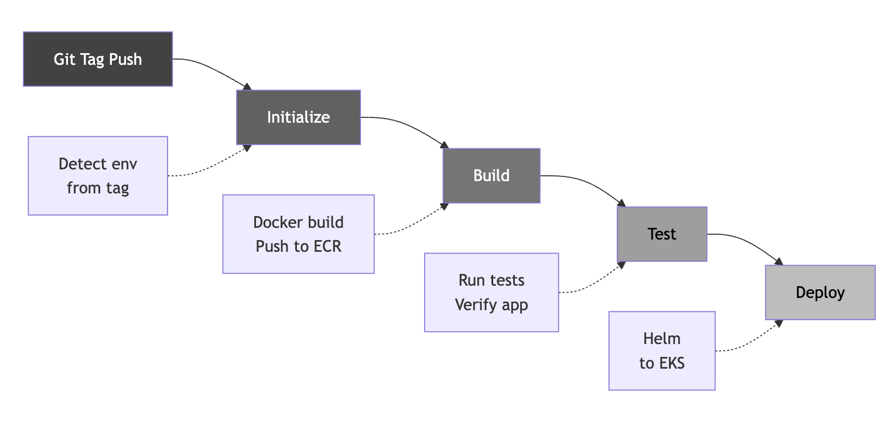

# Task B3 - CI/CD Pipeline for AWS

## Overview

This document describes the CI/CD pipeline implementation using GitHub Actions for deploying Docker-based applications to Amazon EKS. The pipeline supports environment promotion (dev → staging → prod) with protected environments. Note: This is a simple sample application, so the test stage uses basic container health checks as placeholders rather than comprehensive test suites.

## Git Workflow Choice

### Decision: GitHub Flow with Tagging

**Note**: Git workflow selection is highly dependent on team structure, organizational culture, and requires discussion. Different workflows (Git Flow, GitHub Flow, GitLab Flow, Trunk-Based Development) each have their merits and trade-offs.

This implementation uses **GitHub Flow with semantic versioning tags** for the following reasons:

#### Why GitHub Flow?

1. **Simplicity**: Single main branch reduces complexity and cognitive overhead

   - No long-lived feature branches that diverge significantly
   - Faster feedback cycles
   - Easier to understand for new team members

2. **Continuous Integration**: Every commit to main is potentially deployable

   - Encourages small, frequent merges
   - Reduces merge conflicts
   - Enables rapid iteration

3. **Tag-Based Deployment**: Semantic versioning tags provide clear deployment triggers

   - `v1.0.0-alpha*` → Development environment
   - `v1.0.0-rc*` → Staging environment
   - `v1.0.0` → Production environment
   - Tags are immutable and provide clear audit trail

4. **Environment Promotion**: Natural progression through environments

   - Same codebase, different environments
   - Tag format clearly indicates deployment target
   - No branch-based environment mapping complexity

5. **GitHub Native**: Leverages GitHub's built-in features
   - Protected branches
   - Environment protection rules
   - Pull request reviews
   - Tag-based workflow triggers

#### Implementation Details

- **Main Branch**: `main` (or `master`) - always deployable
- **Feature Development**: Short-lived feature branches → PR → merge to main
- **Deployment Triggers**: Git tags matching semantic versioning patterns
- **Environment Mapping**: Tag suffix determines target environment
- **Rollback**: Deploy previous tag or use Helm rollback

This approach balances simplicity with the need for controlled deployments across multiple environments, making it suitable for teams that want straightforward workflows without the overhead of complex branching strategies.

## Pipeline Files

| Component    | Workflow File                                                                                    |
| ------------ | ------------------------------------------------------------------------------------------------ |
| **Backend**  | [backend/.github/workflows/deploy-backend.yml](backend/.github/workflows/deploy-backend.yml)     |
| **Frontend** | [frontend/.github/workflows/deploy-frontend.yml](frontend/.github/workflows/deploy-frontend.yml) |

## Architecture



## Environment Promotion Strategy

Environments are determined by Git tag patterns:

| Tag Pattern      | Environment | Values File           | Example                          |
| ---------------- | ----------- | --------------------- | -------------------------------- |
| `v*-alpha*`      | Development | `values-dev.yaml`     | `v1.0.0-alpha`, `v1.0.0-alpha.1` |
| `v*-rc*`         | Staging     | `values-staging.yaml` | `v1.0.0-rc`, `v1.0.0-rc.1`       |
| `v*` (no suffix) | Production  | `values-prod.yaml`    | `v1.0.0`, `v1.2.3`               |

### Deployment Flow

```
Development          Staging              Production
    │                   │                     │
    ▼                   ▼                     ▼
v1.0.0-alpha  ──▶  v1.0.0-rc  ──▶  v1.0.0
    │                   │                     │
    ▼                   ▼                     ▼
┌────────┐         ┌─────────┐         ┌───────────┐
│  DEV   │         │ STAGING │         │   PROD    │
│ Cluster│         │ Cluster │         │  Cluster  │
└────────┘         └─────────┘         └───────────┘
```

## Pipeline Stages

### 1. Initialize Stage

Detects the target environment from the Git tag and sets pipeline variables.

```yaml
- name: Detect environment from tag
  run: |
    TAG="${{ github.ref_name }}"

    if [[ "$TAG" =~ ^v[0-9]+\.[0-9]+\.[0-9]+-alpha ]]; then
      echo "environment=dev" >> $GITHUB_OUTPUT
    elif [[ "$TAG" =~ ^v[0-9]+\.[0-9]+\.[0-9]+-rc ]]; then
      echo "environment=staging" >> $GITHUB_OUTPUT
    elif [[ "$TAG" =~ ^v[0-9]+\.[0-9]+\.[0-9]+$ ]]; then
      echo "environment=prod" >> $GITHUB_OUTPUT
    fi
```

**Outputs:**

- `environment`: Target environment (dev/staging/prod)
- `values-file`: Helm values file to use
- `namespace`: Kubernetes namespace
- `tag`: Git tag for image versioning

### 2. Build Stage

Builds Docker images and pushes them to Amazon ECR.

**Key Features:**

- Multi-target builds (backend: php-fpm + nginx)
- Docker layer caching via GitHub Actions cache
- Auto-creates ECR repository if it doesn't exist
- Image scanning enabled on push

```yaml
- name: Build and Push Image
  uses: docker/build-push-action@v5
  with:
    context: .
    push: true
    tags: ${{ steps.ecr.outputs.registry }}/${{ env.ECR_REPOSITORY }}:${{ needs.initialize.outputs.tag }}
    cache-from: type=gha
    cache-to: type=gha,mode=max
```

### 3. Test Stage

**Note**: Since this is a simple sample application, comprehensive test suites are not implemented. The test stage uses basic container health checks as placeholders to demonstrate the CI/CD pipeline structure.

**Backend Tests:**

- Creates isolated Docker network
- Starts PHP-FPM and Nginx containers
- Runs database migrations and seeds
- Simple curl test to verify API endpoint returns expected response

**Frontend Tests:**

- Runs container with nginx
- Simple curl test to verify HTTP 200 response (placeholder for real tests)

```yaml
- name: Run frontend container test
  run: |
    docker run -d --name frontend-test -p 8080:80 "${ECR_REGISTRY}/${ECR_REPOSITORY}:${TAG}"
    sleep 5
    RESPONSE=$(curl -s -o /dev/null -w "%{http_code}" http://localhost:8080/)
    if [ "$RESPONSE" != "200" ]; then
      exit 1
    fi
```

**For Production Applications**: This test stage should be expanded to include:

- Unit tests
- Integration tests
- End-to-end tests
- Security scanning
- Performance tests
- Load testing

### 4. Deploy Stage

Deploys to Amazon EKS using Helm charts.

**Key Features:**

- Uses environment-specific secrets from GitHub Environments
- Configures kubectl with EKS cluster credentials
- Deploys via Helm with environment-specific values
- Waits for deployment to complete (10 minute timeout)

```yaml
- name: Deploy to EKS
  run: |
    helm upgrade --install \
      -n ${{ needs.initialize.outputs.namespace }} \
      backend \
      ./helm \
      -f ./helm/${{ needs.initialize.outputs.values-file }} \
      --set image.repository=${ECR_REGISTRY}/${ECR_REPOSITORY} \
      --set image.tag=${TAG} \
      --wait \
      --timeout 10m
```

## Protected Environments

GitHub Environments provide:

- **Environment-specific secrets**: AWS credentials, RDS credentials per environment
- **Required reviewers**: Production deployments can require manual approval
- **Deployment branches**: Restrict which branches can deploy to each environment

### Configuration

1. Go to **Settings > Environments** in GitHub repository
2. Create environments: `dev`, `staging`, `production`
3. For `production`, add protection rules:
   - Required reviewers
   - Wait timer (optional)

### Secrets per Environment

| Secret                  | Description                    |
| ----------------------- | ------------------------------ |
| `AWS_ACCESS_KEY_ID`     | AWS credentials for deployment |
| `AWS_SECRET_ACCESS_KEY` | AWS credentials for deployment |
| `EKS_CLUSTER_NAME`      | Target EKS cluster name        |
| `RDS_IDENTIFIER`        | RDS instance identifier        |
| `RDS_USERNAME`          | Database username              |
| `RDS_PASSWORD`          | Database password              |

## Infrastructure as Code

The pipeline integrates with Terraform-managed infrastructure:

| Component            | Managed By                   |
| -------------------- | ---------------------------- |
| EKS Cluster          | Terraform                    |
| ECR Repositories     | GitHub Actions (auto-create) |
| RDS Instances        | Terraform                    |
| VPC/Networking       | Terraform                    |
| GitHub Environments  | Terraform                    |
| Kubernetes Resources | Helm Charts                  |

## Pipeline Features Summary

| Feature                    | Implementation                                             |
| -------------------------- | ---------------------------------------------------------- |
| **Docker Build**           | Multi-stage Dockerfile, BuildKit caching                   |
| **Container Registry**     | Amazon ECR with image scanning                             |
| **Testing**                | Basic container health checks (placeholder for simple app) |
| **Deployment**             | Helm charts to EKS                                         |
| **IaC**                    | Terraform + Helm                                           |
| **Environment Promotion**  | Tag-based (alpha → rc → release)                           |
| **Protected Environments** | GitHub Environments with secrets                           |
| **Secrets Management**     | GitHub Secrets per environment                             |
| **Rollback**               | Helm rollback capability                                   |

## Security Considerations

1. **Least Privilege**: Each environment has its own AWS credentials with minimal permissions
2. **Secret Isolation**: Secrets are scoped to specific environments
3. **Image Scanning**: ECR scans images on push for vulnerabilities
4. **Protected Production**: Production deployments can require manual approval
5. **Audit Trail**: GitHub Actions provides full deployment history
